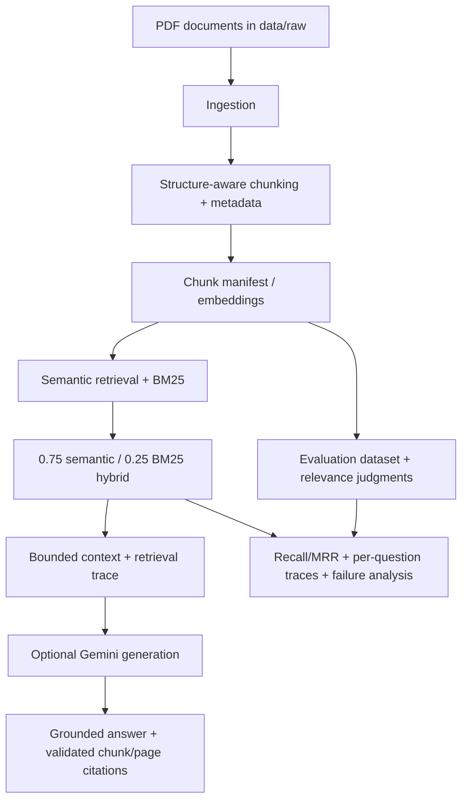

# RAG Research Assistant — Grounded Answers, Citations, and Evaluation

A local research-assistant baseline for answering questions over source PDFs. It preserves document/page metadata through ingestion and structure-aware chunking, uses measured semantic + BM25 hybrid retrieval, constructs bounded evidence context, and returns traceable chunk/page citations. Retrieval is evaluated against a tracked 15-question, 127-chunk corpus; experiments and failure analysis are retained as versioned artifacts rather than silently changing the production path.

## Architecture

## Final retrieval configuration

* **Embedding model:** `sentence-transformers/all-MiniLM-L6-v2`.
* **Production retrieval:** normalized-score hybrid retrieval: **0.75 semantic / 0.25 BM25**. The production default answer context is five chunks (`RAG_TOP_K=5`); the frozen retrieval evaluation reports rankings through top 10.
* **Not selected:** no reranker, MultiQuery, RRF, or round-robin fusion is imported by the production path. These remain isolated experimental code/artifacts because the available evidence does not justify their extra complexity as a general improvement.
* Scores are deterministically ordered by descending score and ascending `chunk_id` for ties. The pipeline trace contains query, configuration class, ranks, scores, source/page/section metadata, citations, generation status, and component latency.

## Measured evaluation baseline

The selected baseline was measured on this repository's **15-question evaluation dataset** and frozen relevance judgments, not as a universal performance claim. The persisted selected semantic/BM25 trace reports: **Recall@1 0.5333, Recall@3 0.7333, Recall@5 0.8667, Recall@10 0.9333, MRR 0.6633**. The complete comparisons and question-level analysis are in `evaluation/semantic_retrieval_results.json`, `evaluation/semantic_retrieval_traces.json`, and `evaluation/retrieval_baseline_analysis.md`.

Hybrid retrieval was chosen because semantic similarity handles paraphrase while BM25 rewards exact source terminology. On this small evaluation set, the .75/.25 setting had the highest observed Recall@1 and MRR; .50/.50 had higher Recall@3, so the choice is documented as a measured trade-off, not a general theorem.

## q009 controlled terminology-aligned ablation

The final predeclared control is the original q009 question. The single aligned query is:

> How can SELF-RAG use a Retrieve=Yes threshold, Critique/reflection-token weighted decoding including ISSUP support, and hard Critique-token filtering to control retrieval, evidence grounding, and generation quality at inference time with no additional training?

Its terms are taken directly from `paper1_c0027`–`paper1_c0030`. It changes **only** query wording; it freezes the 127 chunks, metadata, model, BM25, .75/.25 weighting, relevance judgments, ranking policy, and final-k, with no reranking, MultiQuery, or fusion. `scripts/evaluate_q009_terminology_ablation.py` persists per-chunk semantic/BM25/hybrid ranks and scores, top-10/top-30 entry, Recall@10/@30, evidence coverage, and q009 MRR when the model dependency is available.

**Current execution status: not_run in this environment.** Python 3.14.4 lacks `sentence_transformers` (and its compatible Torch stack), so no q009 ranks or metrics were fabricated. The persisted status and exact query are in `evaluation/q009_terminology_aligned_ablation.json`. Run the command in a supported environment before making any production retrieval change. Therefore the simpler measured .75/.25 baseline remains selected.

## Repository map and reproducibility

| Need | Location / command |
| --- | --- |
| Add source PDFs | `data/raw/` |
| Ingest and build a manifest | `python scripts/build_gold_retrieval_set.py` (see script arguments) |
| Ask with generation | `GEMINI_API_KEY=... python scripts/ask.py "What are reflection tokens?"` |
| Inspect retrieved evidence without an LLM | `python scripts/ask.py --no-generation "What are reflection tokens?"` |
| Lexical baseline evaluation | `python scripts/evaluate_retrieval.py` |
| Semantic/hybrid evaluation | `python scripts/evaluate_semantic_retrieval.py` |
| Final q009 controlled ablation | `python scripts/evaluate_q009_terminology_ablation.py` |
| Tests | `pytest -q` |

Install dependencies using a Python version supported by the pinned `sentence-transformers`/Torch packages: `python -m pip install -r requirements.txt`. Semantic evaluation may download the embedding model on its first run. `GEMINI_API_KEY` is required only for live generation; `--no-generation` does not call a provider. Generated answer citations are accepted only when their `document_id`, `chunk_id`, and page match retrieved evidence.

## Grounding, failure handling, and observability

Retrieved context is explicitly marked as untrusted data in the prompt. Empty retrieval returns `insufficient_evidence` instead of calling a model; no-provider mode returns evidence and traceable citations without pretending an answer was generated. Provider responses must be JSON and their citations are validated against selected chunks/pages. These measures reduce unsupported answers but do not guarantee zero hallucinations; a model can still give a weakly supported answer if retrieval is weak.

Evaluation runs preserve question text, relevance labels, ranked chunks, scores, pages, sections, and relevance flags. Metrics are recomputed from traces and reject label drift. Historical MultiQuery, fusion, candidate-reachability, and reranking work remains under `src/`/`evaluation/` for inspection but is not on the production dependency path.

## Failure analysis and limits

The retained analysis investigates retrieval failures at question, candidate-rank, chunk, and fusion levels. q009 requires distributed evidence across four chunks and was a top-10 miss in the frozen baseline; the planned aligned-query result must be measured before it can influence production. The project is intentionally limited by PDF extraction quality (especially scans/OCR, tables, equations, and unusual layouts), a small domain-specific evaluation set, embedding-model limitations, provider availability/rate limits, and local inference resources.

## Portfolio engineering focus

This project demonstrates a compact RAG architecture with hybrid retrieval, evaluation-first development, controlled retrieval experiments, failure analysis, grounding and citation validation, structured request traces, reproducibility artifacts, and explicit complexity/quality trade-offs. It does not claim deployment at enterprise scale, autonomous research, perfect retrieval, or hallucination-free generation.

## Additional records

Architecture decisions: `docs/adr/ADR-001-through-008.md`. Historical experiments and analyses: `evaluation/`. The tracked artifacts distinguish the current baseline from rejected or unselected experiments.
